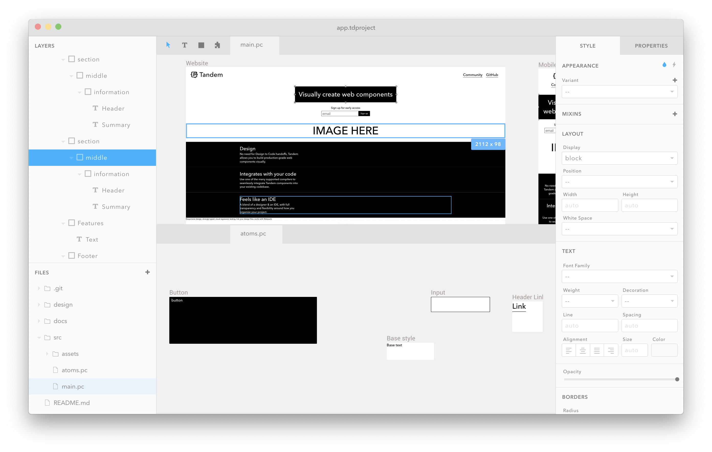

  
  <h1 align="center">Tandem (Preview)</h1>

 

> This repository is _temporarily_ private until bugs & UX issues have been worked out. I'd like to make sure that everything is solid before public testing, so please don't share the app. 🙂

 

Tandem is a visual editor for building web components. It can cover _most_ of your HTML & CSS development, and is designed to be compatible with most web-based languages, and frameworks. It currently works with React.

Tandem is created with scalability & maintainability in mind first, and as a litmus test, Tandem is being used to build itself.

## Features

Features are actively being _discovered_ while Tandem is applied to real problems (currently being used to build itself). Here are just a few highlights:

#### Visual programming where it makes sense

The aim for Tandem is to offer visual programming tools where it makes more sense to do visually than by hand. This means HTML, CSS, and _simple_ behavior. Everything else can be added with code in the language of your choice.

#### Compiles to code

Compile UI files to your language or framework of choice. React is currently supported, static HTML, PHP, Vue, and other targets are in the pipeline.

#### Decoupled from your code

Tandem components are decoupled from your code, so you can re-use your UIs however you want.

#### Organizes like code

Tandem allows you to split components out into separate files that can be integrated into your existing codebase, and organized however you want. Take a look at the Tandem source code for an example on how this can be done: https://github.com/crcn/tandem-preview/tree/master/packages/front-end/src/components

#### Safety

Tandem provides safety measures to ensure that your web components are built correctly. Tools like typed definition file generation for TypeScript-based projects, QA testing tools (soon) to provide you with a screenshot of every visual state of your application, and automated visual regression testing (soon). Visual tooling is also crafted to ensure that you can scale & manage Tandem components to any project size (todo - more on this).

#### Automatically translate designs from Sketch & Figma

Tandem provides [CLI tooling](./packages/paperclip-design-converter) for Sketch & figma that allow you to quickly translate design files (not completely though, you still need to specify layout constraints however). You'll soon be able to even use your original design files as the source of truth for basic styles like colors & fonts.

## Resources

Ready to get started? Here are a few resources to help you out:

- [User Guide](./docs/user-guide)
- [Terminology & Concepts](./docs/concepts.md)
- [Goals & Non-goals](./docs/goals.md)
- [Design process](./docs/design-process.md)
- [Examples](https://github.com/tandemcode/examples)
- [Document format](./docs/document-format.md)
- Contributing
  - [Development](./docs/contributing/development.md)
