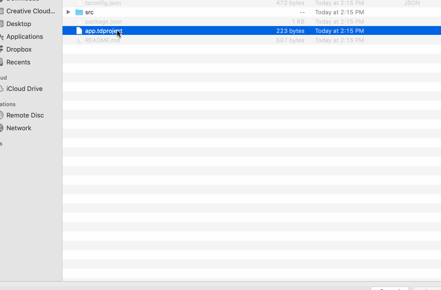

TODO:

## 1. Setting up a Tandem project

First up you'll probably want to setup a Tandem project. To do that, create a `app.tdproject` file in your app's root directory, then paste the following contents into it:

```javascript
{

  // Tandem will use this directory as a starting point to scan for all `*.pc` files.
  "rootDir": ".",

  // This tells Tandem where _not_ to look for `*.pc` files.
  "exclude": [
    "node_modules"
  ]
}
```

> Docs for `*.tdproject` can be found [here](./project-file.md).

Save that, then open the project file in Tandem. Once ypur project is open, go to the file navigator and add a new component file.



That's it! From here you can start building UIs. Note that you can have as many UI files as you want, and they can be organized anywhere in your project. Generally what _I_ like to do is create one UI file per component.

Now onto setting up your build configuration:

## 2. Configuring your bundler

Setting up the build configuration is necessary in order to connect UI files with your application code.

#### Webpack setup

Here's a basic `webpack.config.js` example:

```javascript
const fs = require("fs");

module.exports = {
  mode: "development",
  entry: "./src/index,js",
  output: {
    path: "./lib",
    filename: "[name].bundle.js"
  },
  resolve: {
    extensions: [".js", ".ts"]
  },
  module: {
    rules: [
      {
        test: /.pc$/,
        use: [
          {
            loader: "paperclip-react-loader",
            options: {
              // the config is just the contents of your Tandem project file.
              config: JSON.parse(fs.readFileSync("./app.tdproject", "utf8"))
            }
          }
        ]
      }
    ]
  }
};
```

Additonal documentation for Webpack can be found in the [paperclip-react-loader package](../packages/paperclip-react-loader).

---

After you have your webpack

## 3. Creating UI controllers
