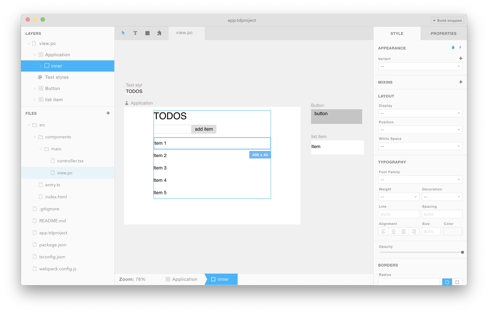

**Installation**: `npm install paperclip-react-compiler`

**Example**: [Todo App](./examples/todos)

#### Importing Tandem UIs into React

This module compiles Tandem UIs into React components, and typed definition files for those components. For example, say you have a `components.pc` UI file that looks like this:



Assuming that you don't have any [controllers](#adding-controllers) associated with the components above, you can use them like so:

```javascript
import {Application, Button, ListItem} from './path/to/components.pc';

<Application />
<ListItem />
<Button />
```

> To import `*.pc` files like this, you'll need to use the [webpack loader](../paperclip-react-loader), or the [CLI tool](#cli-usage).

Notice that the components above are all exported using their labels converted to PascalCase: `list item` is imported as `ListItem`, `Button` is imported as `Button` (no change since already PascalCase), and `Application` is imported as `Application`.

#### Setting properties to nested nodes

Looking at the layer names of our todo app:


To define props for the `new item input` & `add item button` layers, we can do that in React like so:

```javascript
<Application
  newItemInputProps={{ onChange: onNewItemInputChange }}
  addItemButtonProps={{ onClick: onAddItemButtonClick }}
/>
```

Layer props can be defined at the component level by taking the layer name, and using the camelCase version of it, then adding `Props` (excluding [slots](#using-slots)) to the end of that (`item container` -> `itemContainerProps`, `title` -> `titleProps`).

#### Using slots

Slots are areas of your component where you can dynamically insert elements (good for dynamic lists, component states, etc). You can find them in Tandem by looking for layers with a light box icon.

[SLOT IMAGE HERE]

The `items` slot layer you see above can be coded like so:

```javascript
<Application items={"hello world"} />
```

☝️ The result of this would be:

[SCREENSHOT]

Slots can be defined by converting their layer name to `camelCase`.

#### Adding controllers

Controllers add behavior to your component, and can be added in Tandem like so:

[GIF]

A basic controller for our `Application` component might look something like this:

```typescript
import * as React from "react";

// The React compiler can generated TypeScript definition files from .pc files for safely
// integrating with UIs designed in Tandem.
import { BaseApplicationProps } from "./view.pc";

// Props are exported here
export type Props = {};

type State = {
  clickCount: number;
};

// This is factory for creating a controller. The Base variable is the UI designed in Tandem compiled down to React. The React class returned
// here adds behavior to the Base UI.
export default (Base: React.ComponentClass<BaseApplicationProps>) =>
  class ApplicationController extends React.PureComponent<Props, State> {
    state = {
      clickCount: 0
    };

    onCounterButtonClick = () => {
      this.setState({ clickCount: this.state.clickCount + 1 });
    };
    render() {
      // Render Base and add behavior. Behavior is added
      // by defining props that correspond with an element's label.
      // "Counter Button" for example takes "counterButtonProps".
      // "Click Count Into" for example takes "clickCountInfoProps".
      return (
        <Base
          counterButtonProps={{
            onClick: this.onCounterButtonClick
          }}
          clickCountInfoProps={{
            text: `Click count: ${this.state.clickCount}`
          }}
        />
      );
    }
  };
```

Controllers are coupled to the UIs they're attached to, so if you're creating something generic like a dropdown UI and add a controller, that controller will be used wherever the dropdown is.

#### CLI Usage

Here's are some basic examples of how you can use the CLI tool:

```bash
paperclip-react-compiler "src/**/*.pc" # compile PC files & print to stdout
paperclip-react-compiler "src/**/*.pc" --out=lib --write # compile PC files & write to lib
paperclip-react-compiler "src/**/*.pc" --definition --out=lib --write # compile typed definition files for PC components & write to lib

paperclip-react-compiler "src/**/*.pc" --out=lib --write --watch # compile UI components whenever there's a file change
```

The `--definition` flag is particularly useful for identifying props that we can define in our UI. Using the same example screenshot above, the typed definition contents of that would be something like:

```typescript
import * as React from "react";
import ApplicationController0, {
  Props as ApplicationController0Props
} from "./controller";

type TextProps = {
  text?: string;
} & React.HTMLAttributes<any>;

type ElementProps = {
  ref?: any;
} & React.HTMLAttributes<any>;

export type BaseApplicationProps = {
  items?: any;
  innerProps?: ElementProps;
  titleProps?: TextProps;
  inputContainerProps?: ElementProps;
  newItemInputProps?: ElementProps;
  addItemButtonProps?: _a1a6fe8164Props;
  itemsContainerProps?: ElementProps;
  itemProps?: _a1a6fe8185Props;
  itemProps1?: _a1a6fe8185Props;
  itemProps2?: _a1a6fe8185Props;
  itemProps3?: _a1a6fe8185Props;
  itemProps4?: _a1a6fe8185Props;
} & ElementProps;

export type _a1a6fe813Props = ApplicationController0Props;
export const Application: (
  props: ApplicationController0Props
) => React.ReactElement<ApplicationController0Props>;

/*
... More generated typed definition file code ...
*/
```
